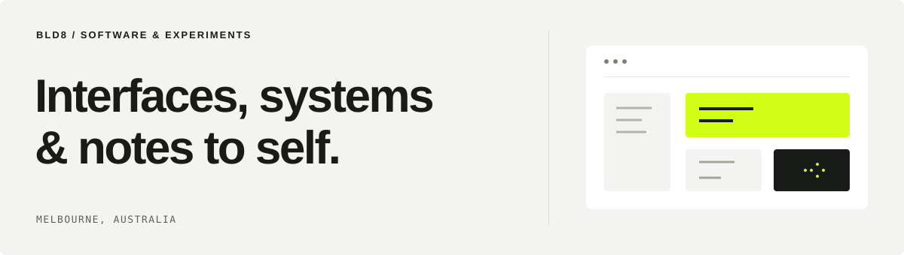

<picture>
  <source media="(prefers-color-scheme: dark)" srcset="assets/profile-dark.svg">
  
</picture>

# Hi, I'm Jaison.

Senior software engineer based in Melbourne. I build web applications and UI platforms, with an eye for clear layouts, thoughtful interactions and the services behind them.

**[Website](https://www.bld8.dev)** &nbsp; / &nbsp; **[UI playground](https://bld8-ui.vercel.app)** &nbsp; / &nbsp; **[About](https://www.bld8.dev/about)**

## Selected work

BLD8 is where I build personal projects and work through the details.

### BLD8 UI

A React component library built on Base UI, with a live showcase for controls, layouts and motion. First edition.

[Playground](https://bld8-ui.vercel.app)

### The BLD8 website

A home for projects and their write-ups. Next.js, React and handwritten CSS.

[Website](https://www.bld8.dev)

## Engineering interests

- **UI engineering.** Building and maintaining React and Angular component libraries. I care about typography, spacing, keyboard interaction and motion that feels natural.
- **Application development.** A background in .NET and C# services, alongside web interfaces. Current interests extend to Next.js, React Native, NestJS and Python.
- **AI research.** Exploring retrieval, model behaviour and evaluation through reading and small experiments.

## On the bench

**BLD8 Workbench** is a planned tool for following AI requests through sources, model calls, tools and cost. Project notes and draft architecture are available; implementation hasn't started.

---

**Notes to self** — keep the interface clear, make the small interactions count, and write down what the experiments actually show.
